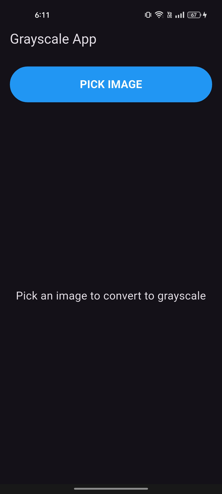
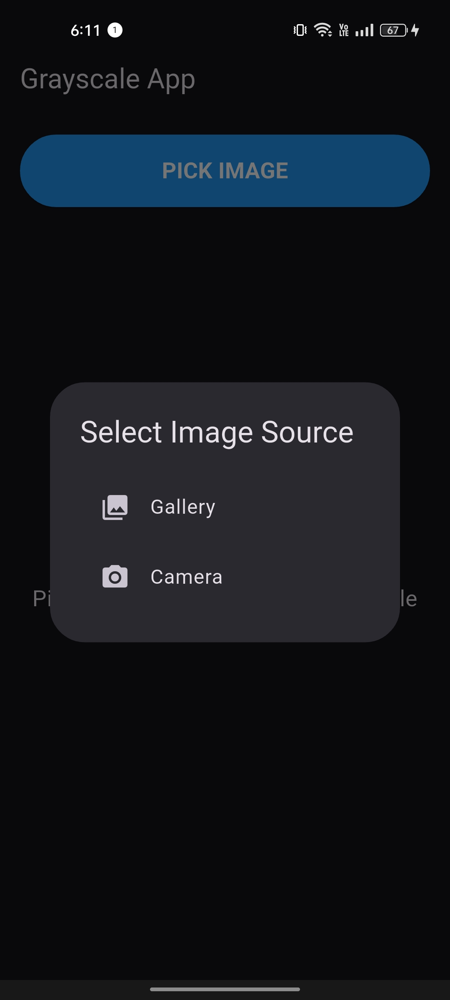
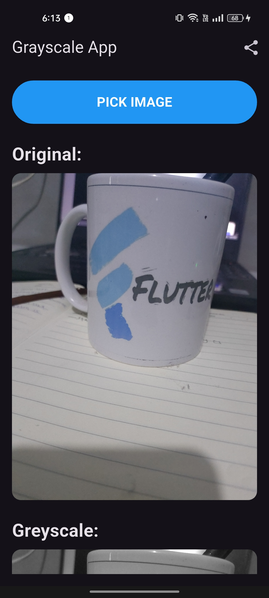
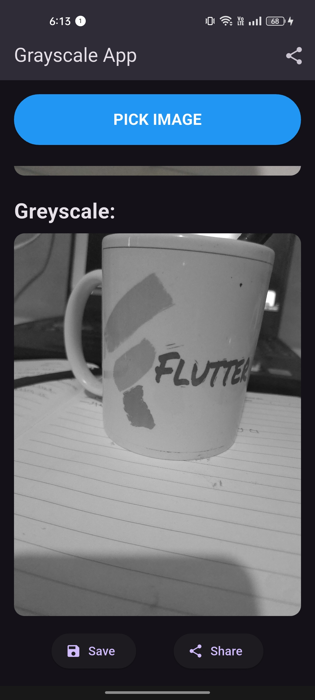

# 📸 Grayscale Image Converter App

This Flutter application allows users to select images from their gallery or camera and convert them instantly into grayscale images. It provides a simple, intuitive user interface, seamless performance, and convenient sharing and saving functionalities.

---

## 🚀 Features

- **Image Selection:** Choose images directly from the device gallery or capture new ones using the camera.
- **Instant Grayscale Conversion:** Automatically convert images into grayscale with efficient image processing.
- **Share & Save:** Easily save the grayscale image to device storage or share it directly via social media platforms.
- **User-friendly Interface:** Clean, simple, and responsive design ensuring excellent user experience.

---

## 🛠️ Tech Stack

- **Flutter:** Cross-platform UI toolkit.
- **Provider:** State management.
- **image_picker:** For image selection from gallery or camera.
- **image:** Image processing and conversion.
- **path_provider:** Handling file storage.
- **share_plus:** Enables sharing images.
- **permission_handler:** Manages device permissions.

---

## 📂 Project Structure

```bash
lib/
├── core/
│   └── utils/
│       └── storage_utils.dart
├── data/
│   └── models/
│       └── image_model.dart
├── providers/
│   └── image_provider.dart
├── services/
│   └── image_service.dart
└── presentation/
    └── screens/
        ├── home_screen.dart
        └── result_screen.dart
```

---

## 🛎️ How to Run

1. **Clone the Repository:**
```bash
git clone <repository_url>
```

2. **Install Dependencies:**
```bash
flutter pub get
```

3. **Run the App:**
```bash
flutter run
```

---

## 📷 Screenshots

| ----- |
|-------------- |
| [Pick Image, Save, Share Buttons] | [Original vs Grayscale Comparison] |

*(Screenshots to be added)*

---

## 📖 Contributing

Feel free to contribute by:
- Reporting bugs
- Suggesting new features
- Improving documentation

--

✨ **Happy Coding!**
